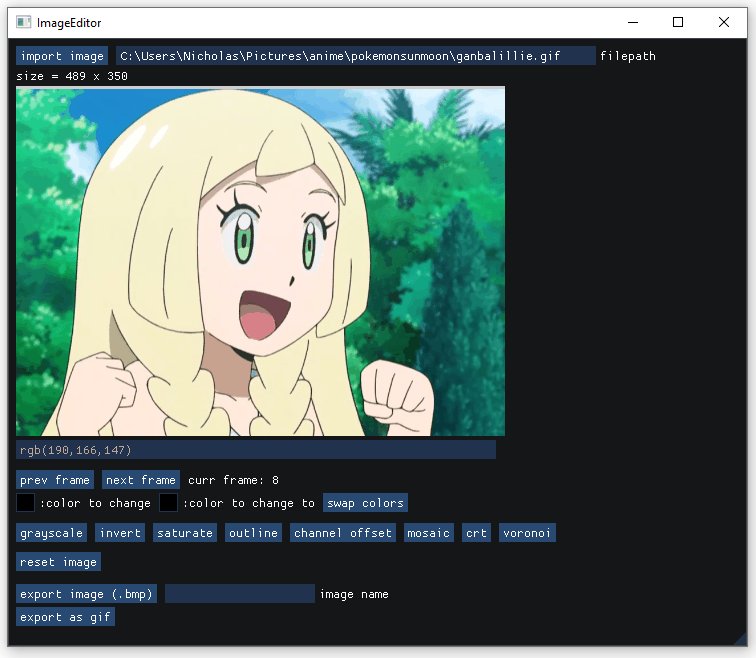

# imgui_image_editor    
### a basic image editor using Dear ImGui and C++    
    
not much to see here right now, but it has a few filters and you can rotate the image and export your edits :)    
    
    
    
can do some basic gif handling like editing frames :D    
    
    
    
### installation    
I'm currently using MinGW and MSYS to compile this project. Note that I have some windows.h specific stuff (just for the file dialog to more easily import an image) - if windows.h is not available, remove the `-DWINDOWS_BUILD` flag in the Makefile before running `make`.    
    
### acknowledgements    
thanks to the contributors of [GIFLIB](http://giflib.sourceforge.net/) and [gif.h](https://github.com/charlietangora/gif-h), which I used for the gif stuff in this project.