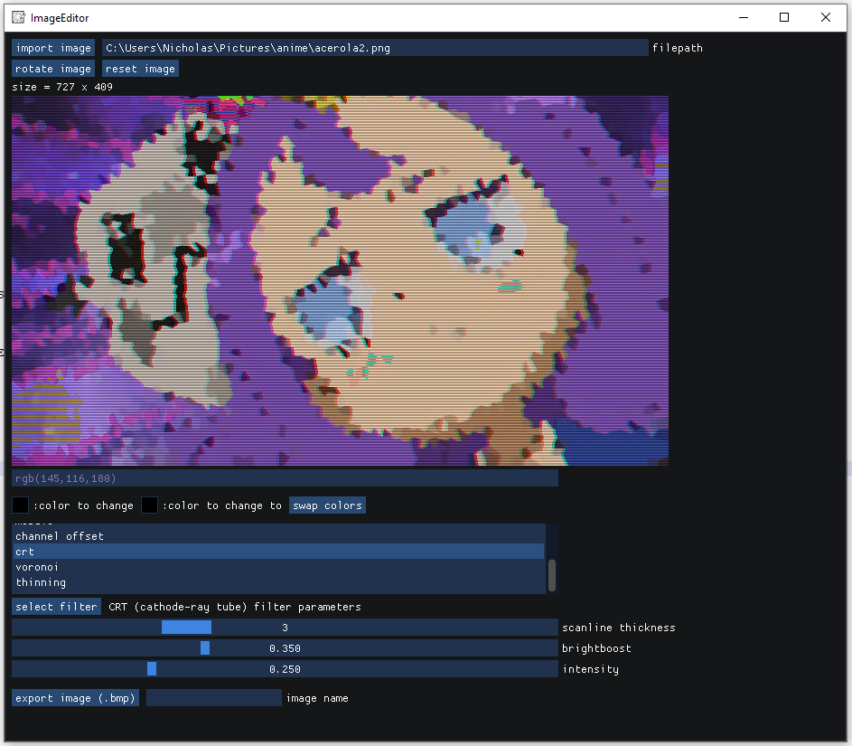

# imgui_image_editor    
### an image editor/viewer made with Dear ImGui, SDL2 and C++    
    
not much to see here right now, but it has a few filters and you can rotate the image and export your edits :)    
    
    
    
can do some basic gif handling and editing of their frames :D. there's also some APNG support (mainly for viewing purposes atm) but it's not perfect (yet).    
    
    
    
### installation    
I'm currently using [gcc 12.2.0 + MinGW-w64 10.0.0 (UCRT)](https://winlibs.com/) and MSYS to compile this project (since I'm using Windows). Note that I have some windows.h specific stuff (just for the file dialog to more easily import an image) - if windows.h is not available, remove the `-DWINDOWS_BUILD` flag in the Makefile before running `make`. I have not tested on other platforms so YMMV. Also note that the executable produced needs glew32.dll and SDL2.dll in the same directory to function properly (which are included in this repo).    
    
### acknowledgements    
Thanks to the contributors of [Dear ImGui](https://github.com/ocornut/imgui), [SDL2](https://www.libsdl.org/), [stb_image](https://github.com/nothings/stb/blob/master/stb_image.h) + Jamie Redmond's [additions](https://github.com/jcredmond/stb/commit/71e7e527eedc27f2b9f29fe9fe3991fc6fb24212) to stb_image for APNG support, [GIFLIB](http://giflib.sourceforge.net/), [gif.h](https://github.com/charlietangora/gif-h). Apologies if I've forgotten anyone!